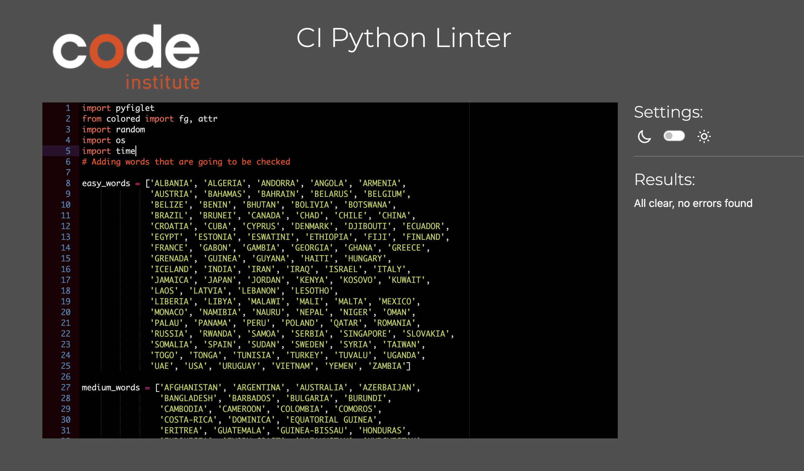

# Python Hangman Game

Python hangman game is a captivating experience that combines the thrill of word guessing with a test of geographical knowledge. Featuring three distinct levels - easy, medium, and hard - players will embark on a journey of discovery to unveil the names of different countries. With each level presenting a unique challenge, this game promises to engage players with its blend of strategy and excitement. Prepare to elevate your gaming experience with this professionally crafted and enticing hangman game.

The game is deployed on Code Institute mock terminal on Heroku. The live app can be found [here.](https://hangman-python-game-1-08a243b6044c.herokuapp.com/ "Hangman Game.")

## Tools and technologies used

### Languages

- Python language and Python modules are listed below.
  - [random](https://docs.python.org/3/library/random.html) To randomize the order of the countries.
  - [os](https://docs.python.org/3/library/os.html?highlight=os#module-os) To get the operating system name and clear the screen after some user options.
  - [time.sleep](https://docs.python.org/3/library/time.html?highlight=sleep#time.sleep) To add a delay after the user answers a question correctly.
  - [pyfiglet](https://pypi.org/project/pyfiglet/0.7/#:~:text=Pyfiglet%20is%20also%20a%20library,fonts%20from%20a%20zip%20archive.) To add some ascii text art.
  - [colored](https://pypi.org/project/colored/) Was used to add color to the terminal.

### Other tools and programs.

- [Visual Studio Code.](https://code.visualstudio.com/) Did all of my coding and synchronizing with GitHub on VS Code.
- [Google](https://www.google.ie/?gws_rd=ssl) Sheets to store leaderboard.
- [GitHub](https://github.com/) for hosting repositories.
- [Heroku](https://www.heroku.com/) where the game is deployed using the [Code Institute](https://codeinstitute.net/ie/) Python template.

## Existing Features

### Main menu and level selection

- This is the main page when the program is run. To continue user has to choose a difficulty level (easy, medium, hard).

  

### Difficulty level - Easy

- When the user chooses easy as the difficulty level, the game starts.

- As the game progresses in easy mode, the user has to guess the country name which consists of less than 8 characters.

### Difficulty level - Medium

- When the user chooses medium as the difficulty level, the game starts.

- Medium mode is where the user has to guess a country name that is between 8 to 13 characters.

### Difficulty level - Hard

- When the user chooses easy as the difficulty level, the game starts.

- Hard mode is the monter level where you have to guess a country name that has 16 characters and more.

### Success

- When the user guesses the word correctly within the available attempts, the user wins the game.

### Failure

- When the user fails to guess the word correctly within the lives available, a failure message is shown and the hangman dies.

### Future Features to be added

- It would be nice to have a timer for differnt difficulty levels
- It would be nice to save users' stats.

## Testing

This app was developed on a macbook air desktop running mac OS. Testing was performed both locally and when deployed to Heroku. The program was tested using different inputs and scenarios. Everything worked correctly and as expected.

### PEP8 Code Institute Python Linter Testing

- the only issue is the spaces in the hangman stages section, which cannot be avoided as they must remain in their current positions.

  

### Lighthouse testing

- Google Chrome Lighthouse was used to test the performance of the app. Testing was performed in private browsing mode.

## Deployment

### Heroku deployment

1. Head over to the Heroku website and either log in if you have an account, or sign up if you need to create one.
2. Click the "New" button in the top-right corner of the dashboard and choose "Create new app" from the drop-down menu.
3. In the "App name" field, input a unique name for your app. A green checkmark will appear if the name is available.
4. Under the "Choose a region" field, select either the United States or Europe depending on your location.
5. Click the "Create app" button.
6. On the next page, navigate to the "Settings" tab at the top-center of the screen.
7. In the "Buildpacks" section just below, click "Add buildpack." Ensure you add them in the following order:
8. Select "Python" and click "Save changes."
9. Click "Add buildpack" again, select "Node.js," and save the changes.
10. Return to the top of the page and go to the "Deploy" tab.
11. Under the "Deployment method" section, choose "GitHub."
12. In the "Connect to GitHub" area, click "Search," find your project repository, and click "Connect."
13. Scroll down and click "Enable Automatic Deploys" to trigger redeployments when you push new commits.
14. Finally, click "Deploy Branch" at the bottom of the page.
15. Once the build process starts, you’ll see the log at the bottom of the screen. When it's complete, a link to your app will be provided.

## Resources

- [Stackoverflow](https://stackoverflow.com/)
- [tutorialspoint](https://www.tutorialspoint.com/index.htm)

## Credits

### Acknowledgements

- [Code Institute](https://codeinstitute.net/ie/) Love Sandwiches and python content.
- [Slack community](https://slack.com/intl/en-ie/) for emotional support.

### Youtube channels that was in great help for my project are:

- [Programming with Mosh](https://www.youtube.com/@programmingwithmosh) great python explanation.
